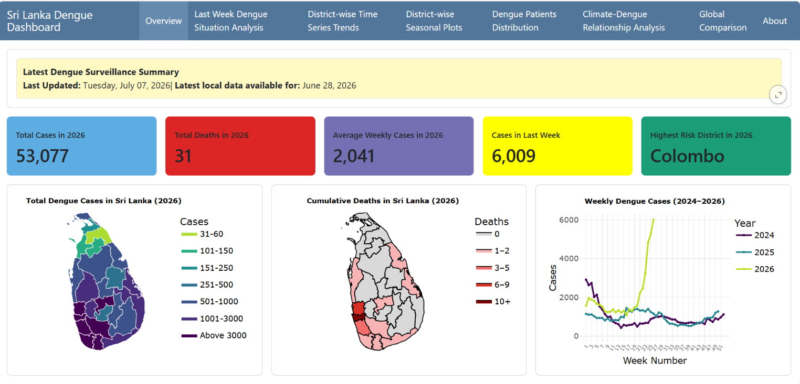
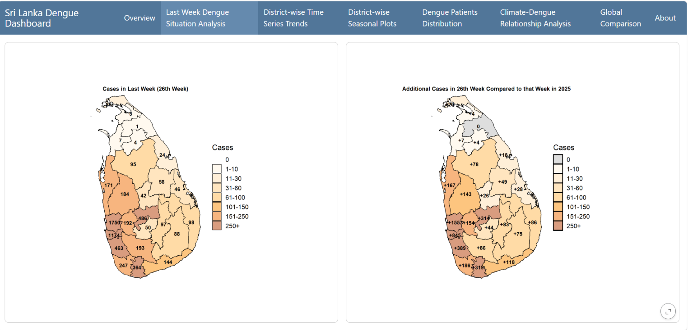
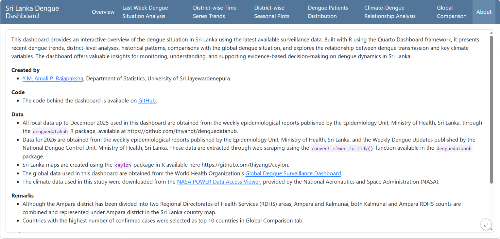

This dashboard provides an interactive overview of the dengue situation in Sri Lanka using the latest available surveillance data. Built with R using the Quarto Dashboard framework, it presents recent dengue trends, district-level analyses, historical patterns, comparisons with the global dengue situation, and explores the relationship between dengue transmission and key climate variables. The dashboard offers valuable insights for monitoring, understanding, and supporting evidence-based decision-making on dengue dynamics in Sri Lanka.

## Dashboard Link

<https://amalirajapaksha.github.io/denguedashboard_SriLanka/>

## Created By

Name : Y.M.A.P. Rajapaksha

Index No : AS2022642

## Data

-   All local data up to December 2025 used in this dashboard are obtained from the weekly epidemiological reports published by the Epidemiology Unit, Ministry of Health, Sri Lanka, through the `denguedatahub` R package, available at https://github.com/thiyangt/denguedatahub.

-   Data for 2026 are obtained from the weekly epidemiological reports published by the Epidemiology Unit, Ministry of Health, Sri Lanka, and the Weekly Dengue Updates published by the National Dengue Control Unit, Ministry of Health, Sri Lanka. These data are extracted through web scraping using the `convert_slwer_to_tidy()` function available in the `denguedatahub` package. The processed datasets are available in `data/sri_lanka_weekly_dengue_cases_2026.csv` and `data/last_week_comparisson.xlsx`.

-   The global data used in this dashboard are obtained from the World Health Organization's [Global Dengue Surveillance Dashboard](https://worldhealthorg.shinyapps.io/dengue_global/). The corresponding dataset is available in `data/dengue-global-data.xlsx`.

-   The climate data used in this study were downloaded from the [NASA POWER Data Access Viewer](https://power.larc.nasa.gov/data-access-viewer/), provided by the National Aeronautics and Space Administration (NASA). The processed weekly climate dataset is available in `data/weekly_climate.csv`.

-   All raw data files are available in the `raw-data` directory.

-   All R scripts used for data preprocessing are available in the `pre_processing` directory.

## Methodology

Here, several visualization techniques have been used for different purposes. To explore new visualization techniques that can be applied for disease surveillance and epidemiological analysis, the [Sri Lanka COVID-19 Dashboard](https://thiyangt.github.io/coviddashboard/) (Talagala & De Alwis, 2021) was referred to. To get an overall idea of the methodologies, see Table 1.

\begin{table}[H]
\centering
\caption{Summary of methodologies used in the dashboard}
\begin{tabularx}{\textwidth}{|X|p{4cm}|}
\hline
\textbf{Information Presented} & \textbf{Visualization Technique(s)} \\
\hline
Description of the first methodology. This column is wider and automatically wraps text. & Line Plot \\
\hline
Description of the second methodology. & Choropleth Map \\
\hline
Description of the third methodology. & Scatter Plot \\
\hline
\end{tabularx}
\end{table}

## Results

The dashboard is organized into 8 navigation tabs, including Overview, Last Week Dengue Situation Analysis, District-wise Time Series Trends, District-wise Seasonal Plots, Dengue Patients Distribution, Climate-Dengue Relationship Analysis, Global Comparison, and About. Each tab contains interactive visualizations and analytical outputs. Table 2 provides a description of each tab and summarizes its key content.


### Tab 1

```{r}
#| label: fig-tab1
#| fig-pos: "H"
#| fig-cap: "Screenshot of Tab 1 (Overview)"
#| echo: false


```

## Tab 2

```{r}
#| label: fig-tab2
#| fig-pos: "H"
#| fig-cap: "Screenshot of Tab 2 (Last Week Dengue Situation Analysis)"
#| echo: false


```

## Tab 3

```{r}
#| label: fig-tab3
#| fig-pos: "H"
#| fig-cap: "Screenshot of Tab 3 (District-wise Time Series Trends)"
#| fig-subcap:
#| - ""
#| - ""
#| layout-ncol: 2
#| out-width: "98%"
#| echo: false

knitr::include_graphics(c(
  "images/tab3.a.png",
  "images/tab3.b.png"
))
```

## Tab 4

```{r}
#| label: fig-tab4
#| fig-pos: "H"
#| fig-cap: "Screenshot of Tab 4 (District-wise Seasonal Plots)"
#| fig-subcap:
#| - ""
#| - ""
#| layout-ncol: 2
#| out-width: "98%"
#| echo: false

knitr::include_graphics(c(
  "images/tab4.a.png",
  "images/tab4.b.png"
))
```

## Tab 5

```{r}
#| label: fig-tab5
#| fig-pos: "H"
#| fig-cap: "Screenshot of Tab 5 (Dengue Patients Distribution)"
#| fig-subcap:
#| - ""
#| - ""
#| - ""
#| layout-ncol: 2
#| layout-nrow: 2
#| out-width: "98%"
#| echo: false

knitr::include_graphics(c(
  "images/tab5.a.png",
  "images/tab5.b.png",
  "images/tab5.c.png"
))
```

## Tab 6

```{r}
#| label: fig-tab6
#| fig-pos: "H"
#| fig-cap: "Screenshot of Tab 6 (Climate-Dengue Relationship Analysis)"
#| fig-subcap:
#| - ""
#| - ""
#| - ""
#| - ""
#| - ""
#| layout-ncol: 2
#| layout-nrow: 3
#| out-width: "98%"
#| echo: false

knitr::include_graphics(c(
  "images/tab6.a.png",
  "images/tab6.b.png",
  "images/tab6.c.png",
  "images/tab6.d.png",
  "images/tab6.e.png"
))
```

## Tab 7

```{r}
#| label: fig-tab7
#| fig-pos: "H"
#| fig-cap: "Screenshot of Tab 7 (Global Comparison)"
#| fig-subcap:
#| - ""
#| - ""
#| - ""
#| layout-ncol: 2
#| layout-nrow: 2
#| out-width: "98%"
#| echo: false

knitr::include_graphics(c(
  "images/tab7.a.png",
  "images/tab7.b.png",
  "images/tab7.c.png"
))
```

## Tab 8

```{r}
#| label: fig-tab8
#| fig-pos: "H"
#| fig-cap: "Screenshot of Tab 8 (About)"
#| echo: false


```
